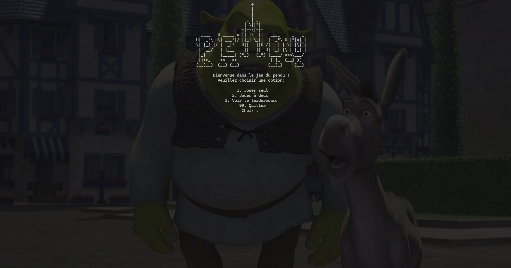
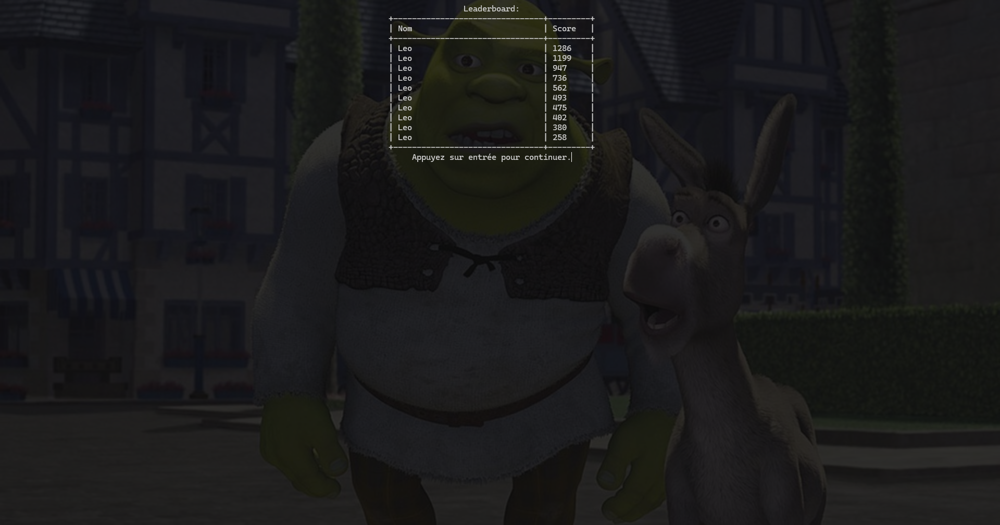
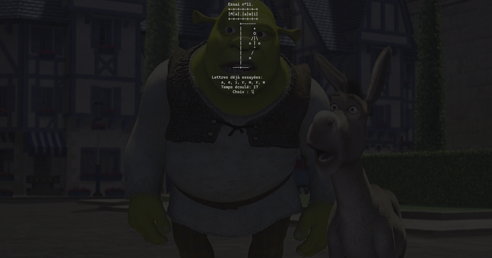
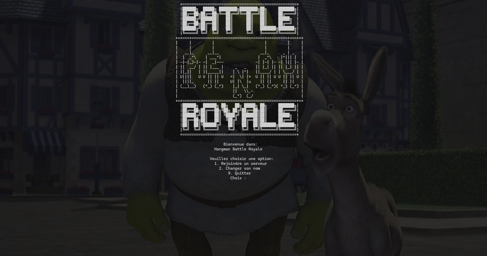

## Hangman

***Implémentation en Go du jeu du pendu***


## Sommaire

- [Fonctionnalités](#fonctionnalités)
- [Compilation du projet](#compilation-du-projet)
- [Builds précompilés](#builds-précompilés)
- [Utilisation](#utilisation)
- [Autres](#autres)

## Fonctionnalités
Hangman est une implémentation simpliste en golang du jeu du pendu.
Ses fonctionnalités principales sont les suivantes:
- Liste de mot personalisable
    - Listes de mots exemples inclues
    - Possibilité d'importer ses propres listes de mots sans difficulté
- Mode multi-joueur (2 joueurs max)
    - Possibilité de faire deviner n'importe quel mot a son adversaire
- Système de score et de tableau des scores
  - Sauvegarde et chargement des scores selon la liste de mot utilisée
  - Nom personalisable dans la liste des scores

- Interface utilisateur claire et intuitive
    - Affichage en ASCII art pour un meilleur confort et une meilleur compréhension
    - Commandes de navigation entre les menus intuitives


## Compilation du projet
Pour compiler le projet executez la commande suivante dans le repertoire racine du repo:

Sur windows:
```shell
build.bat
```

Sur GNU/Linux et MacOS
```shell
./build.sh
```

## Builds précompilés
Des fichiers executables deja compilés sont a votre disposition si vous ne souhaitez/pouvez pas compiler le projet vous même elles sont disponibles dans l'onglet releases ou en cliquant [ici](https://github.com/LDelaforet/Hangman/releases)

## Utilisation
Pour lancer le jeu, vous avez deux options :
- Lancer l'exécutable `hangman` depuis la console.
- Double-cliquer sur l'exécutable depuis l'explorateur de fichiers.

Depuis la console, exécutez simplement la commande suivante :
```shell
hangman <liste de mots>
```

Si vous lancez le jeu depuis l'explorateur de fichiers, vous pouvez soit :
- Double-cliquer sur l'exécutable pour utiliser la liste par défaut.
- Drag n' drop (glisser-déposer) un fichier de liste de mots personnalisé sur l'exécutable.

Si aucune liste de mots n'est spécifiée, le programme utilisera automatiquement la liste contenue dans le fichier `words.txt`.

## Autres:

Une version du jeu en mode de jeu Battle Royale jusqu'a 20 joueurs est actuellement en cours de developpement: [Hangman-BR](https://github.com/LDelaforet/Hangman-BR)